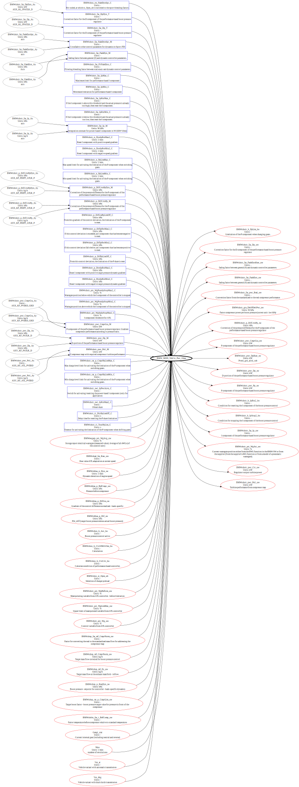

## MapCompare and A2L2SVG: B58 tuning utilities 

Repo with two utilities to help B58 tuning tasks
1. net.jtownson.xdfbinext.MapCompare A utility for comparing two bin files with respect to a tunerpro XDF which applies to both.
2. net.jtownson.xdfbinext.A2LMapCompare A utility for comparing two bin files with respect to an A2L file which applies to both. Less friendly than MapCompare but will find all modified maps and constants in a tune.
3. net.jtownson.xdfbinext.A2L2SVG Graphs functions, characteristics and measurements from an a2l. Turn that nasty, hard to understand a2l into a pretty picture.
4. net.jtownson.xdfbinext.MHDUserChannelGen Create MHD custom logging channel definitions from an a2l and measurement names.

### System requirements

You will need a Java JDK 17+ installed on your system.

These are not production grade tools. You might hit bugs, missing cases and limitations
that require tweaks. If you hit one of these problems, feel free to message me or create
an issue in github. Otherwise, to make tweaks yourself, you will need a Scala 
development environment, such as Intellij with the Scala plugin.

### MapCompare

The idea of MapCompare is to compare bins, according to an XDF so that you can
see the changes you or another tuner have made to a bin relative to some starting point.

This helps to take stock of your changes before flashing and in reverse engineering
changes made by others.

#### MapCompare usage
```shell
Usage: net.jtownson.xdfbinext.MapCompare [options]

--help                   Display usage text
--xdf <value>            XDF model common to both bins
--base-bin <value>       Filename of the starting bin file
--mod-bin <value>        Filename of the bin to compare with the base
--table-exclusions <value> A comma separated list of substrings used to exclude tables. 
                         E.g. '(FF), (FF#2)' => exclude flex fuel tables.
--category-exclusions <value> A comma separated list of exact names used to exclude categories. 
                         E.g. 'MHD+ Suite, MHD+ Config' => exclude these two categories.
--report <value>         Filename of an existing report from which to extract notes and table ordering. Enables re-running of a diff without having to rework notes and table re-ordering.
--output <value>         Output filename for difference report.
```

For example, the following command
```shell
java -cp xbc.jar net.jtownson.xdfbinext.MapCompare --table-exclusions="(Antilag),(Map 2),(Map 3),(Map 4),(FF),(FF#2)" --report "stage-0-vs-stage-1.txt" --xdf "BMW-XDFs\F G series B58\00003076501103.xdf" --base-bin "stage-0.bin" --mod-bin "stage-1.bin"
```
will compare a stage 0 and stage 1 bin, ignoring flexfuel, antilag and multimap tables.

This will produce a text report such as:
```shell
Base bin: stage-0.bin
Modified bin: stage-1.bin
XDF: BMW-XDFs\F G series B58\00003076501103-jmt.xdf

Table (scalar): Load limit factor by rich for component protection
Description: K_FRFMXBS_MN
Categories: Limits
Unit info: -
Base:
    0.500

Difference:
    0.500

Modified:
    1.000

Notes:
    Disables this load limit multiplier.

Table (vector): Max naturally aspirated volumetric efficiency
Description: For naturally aspirated operation, should not exceed 100% KL_LAMX
Categories: Limits
Unit info: 1/min --> %
Breakpoints: Max naturally aspirated volumetric efficiency X (autogen)
Base:
      100      120      163      175      225      250      275      300      325      350      450      475      500      520      540      600      675      695
    92.00    92.00    92.00    92.00    92.00    92.00    92.00    92.00    92.00    92.00    92.00    92.00    92.00    92.00    92.00    92.00    92.00    92.00

Difference:
      100      120      163      175      225      250      275      300      325      350      450      475      500      520      540      600      675      695
     8.00     8.00     8.00     8.00     8.00     8.00     8.00     8.00     8.00     8.00     8.00     8.00     8.00     8.00     8.00     8.00     8.00     8.00

Modified:
      100      120      163      175      225      250      275      300      325      350      450      475      500      520      540      600      675      695
   100.00   100.00   100.00   100.00   100.00   100.00   100.00   100.00   100.00   100.00   100.00   100.00   100.00   100.00   100.00   100.00   100.00   100.00

Notes:
    Adjust volumetric efficiency to simplify calculations
    
...
```

The `--report` option is designed to help with iterative map development. 
It will make the report generator read an existing report and extract notes and tables orderings from it.
Thus, if you have an earlier report with notes and some table ordering that makes sense, but then need to
re-run the diff after map changes, the existing notes and orderings will be maintained in the new report.

The tail of the report contains listings of tables that are not changed and those have been excluded 
due to `--table-exclusions` and `--category-exclusions`.

### Limitations

1. Some older XDFs do not parse since they are missing fields which are mandatory in the current model.

### Usage A2LMapCompare

Compare bin files using an A2L and print out a report with the differences. 
Supports iterative tune development by allowing you to see what has and has not been changed when developing a tune. 
Also useful for reverse engineering existing bin files.

The difference between with A2LMapCompare vs MapCompare is that this app will spot _all_ modified tables in a tune,
not just those that happen to have been imported into an XDF.

```shell
Usage: A2LMapCompare [options]

--help                Display usage text
--a2l <value>         A2L model common to both bins
--base-bin <value>    Filename of the starting bin file
--mod-bin <value>     Filename of the bin to compare with the base
--mod-ignore <value>  List of BMW module names to ignore
--output <value>      Output filename for difference report.
```

### Usage A2L2SVG

A2L2SVG draws graphs of a2l functions, with their inputs and outputs, in order to help vizualize a2ls.
In addition, it can also help in studying FR docs. Although A2L2SVG only shows black box diagrams (rather
than white box computation paths) it will add comments and descriptions (with translation where available)
thus you can use the tool as a study companion which saves having to remember so many variable names.

```shell
Creates a graph based around an a2l function, characteristic or measurement.
Usage: a2l2svg [options]

  --help                 Display usage text
  -f, --function         Use this option to graph a function with its inputs and outputs. Otherwise graphs the named characteristic/measurement
  --a2l <value>          Filename for a2l to parse
  --object-name <value>  name of function if -f is set or other object otherwise.
  --out <value>          output file
```
For example
```shell
java -cp xbc.jar net.jtownson.xdfbinext.A2L2SVG -f --a2l .\src\test\resources\DME861_R1C9J8B3B.a2l --object-name BMW_MOD_TchCtr_Pwr_10ms --out testmodel.svg
```
Produces the tch diagram as follows:


### Usage MHDUserChannelGen

MHDUserChannelGen automates the process of creating `ActualValue` XML to put into an MHD custom logging
channels file. To use this app *you need the correct a2l for your car*.

Given the a2l for your car, you pass this app the names of some DME measurements
and the app will generate an logging channel file.

Usage: MHD User channel generator [options]

--help                  Display usage text
--a2l <value>           An A2L file name
--measurements <value>  List of measurement names from the a2l
--output <value>        Output filename.

example 
```shell
java -cp xbc.jar net.jtownson.xdfbinext.MHDUserChannelGen --measurements=Zwstat_pf1,Dzwt_pf1,Dzw_krann,Dzwdyn,Zw_out --a2l="DME861_R1C9J8B3B.a2l"

```
This will generate output such as the following.

```xml
<?xml version="1.0" standalone="yes"?>
<ActualValues>
  <ActualValue ReqBlock="51802740" Size="1" DataA="2.0" DataB="1.0" Prefix="50" Units="°" RoundingDigits="1">
    <Text xml:lang="en">Dzwdyn</Text>
  </ActualValue>
  <ActualValue ReqBlock="5180273d" Size="1" DataA="2.0" DataB="1.0" Prefix="50" Units="°" RoundingDigits="1">
    <Text xml:lang="en">Zwstat_pf1</Text>
  </ActualValue>
  <ActualValue ReqBlock="5180236a" Size="2" DataA="10.0" DataB="1.0" Prefix="50" Units="°" RoundingDigits="1">
    <Text xml:lang="en">Dzw_krann</Text>
  </ActualValue>
  <ActualValue ReqBlock="51801f14" Size="2" DataA="10.0" DataB="1.0" Prefix="50" Units="°" RoundingDigits="1">
    <Text xml:lang="en">Dzwt_pf1</Text>
  </ActualValue>
  <ActualValue ReqBlock="51801f80" Size="2" DataA="10.0" DataB="1.0" Prefix="50" Units="°" RoundingDigits="1">
    <Text xml:lang="en">Zw_out_1</Text>
  </ActualValue>
  <ActualValue ReqBlock="51801f82" Size="2" DataA="10.0" DataB="1.0" Prefix="50" Units="°" RoundingDigits="1">
    <Text xml:lang="en">Zw_out_2</Text>
  </ActualValue>
  <ActualValue ReqBlock="51801f84" Size="2" DataA="10.0" DataB="1.0" Prefix="50" Units="°" RoundingDigits="1">
    <Text xml:lang="en">Zw_out_3</Text>
  </ActualValue>
  <ActualValue ReqBlock="51801f86" Size="2" DataA="10.0" DataB="1.0" Prefix="50" Units="°" RoundingDigits="1">
    <Text xml:lang="en">Zw_out_4</Text>
  </ActualValue>
  <ActualValue ReqBlock="51801f88" Size="2" DataA="10.0" DataB="1.0" Prefix="50" Units="°" RoundingDigits="1">
    <Text xml:lang="en">Zw_out_5</Text>
  </ActualValue>
  <ActualValue ReqBlock="51801f8a" Size="2" DataA="10.0" DataB="1.0" Prefix="50" Units="°" RoundingDigits="1">
    <Text xml:lang="en">Zw_out_6</Text>
  </ActualValue>
</ActualValues>
```

Note that array outputs, such as Zw_out result in a channel for each array element. In the case of something like
`Zw_out` the names of each channel correspond to the indices of the array, which might be the firing order (1-5-3-6-2-4)
and *not* necessarily the cylinder order.

### Thoughts on future features

1. Map simulation
   This would allow arithmetic expressions referencing table lookups and allow the user
   to feed in ranges of values to see the response from the map. For example, calculate
   the torque request given the values in 'relative torque request' and 'torque request ceiling'
   maps for a range of accelerator pedal inputs. Determine if any inputs fall outside the
   map breakpoints.
